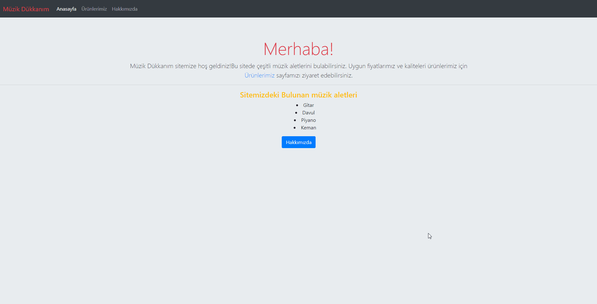

# Müzik Dükkanım Sitesi

## Ödevden Beklenenler :

* HTML kısmını önceki ödevden alabilirsiniz fakat baştan yapmanızı öneririz.
* Menüyü koyu renkli olarak düzenleyin. İsterseniz arka plan rengi de verebilirsiniz.
* Ana sayfaya bir jumbotron koyup içeriğinizin açıklamasını yazınız.
* Arka plan rengini #E9ECEF ile değiştirin.
* Ürünlerimiz sayfasında card yapısını kullanın.
* Kullandığınız card yapısını grid sistemin içinde kullanın.
* Ürün card boyutlarının tamamen aynı olduğuna dikkat edin.
* Hakkımızda sayfasını da bir card yapısı içine alın.

## Görünüm

